# The Report of Passive Attack

The results of membership inference attack in federated learning will be unfolded in this report. And the black magic of membership inference attack may interest you if you have the relevant prior knowledge.

## Global Attack vs Local Attack

To participants, there are 4 kinds of activities during federated training, three of which are in iterations.

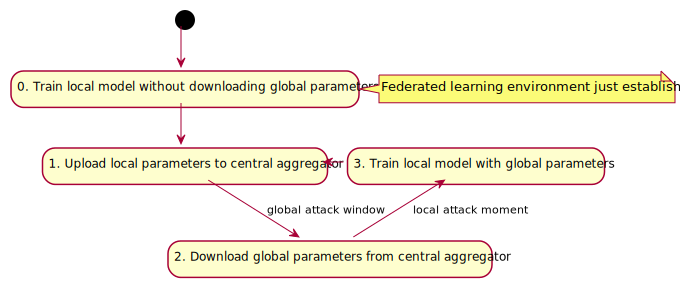

Attack windows slide to the global attacker after uploading  participants' local parameters to the central aggregator.


And when global parameters are pulled down, the participant introduces a back door for local attackers as well.


Apparently, the difference between global attackers and local attackers is **the timing of attack**.

```python
for client_id in active_clients:
    print("[fed-epoch {}] cid: {}".format((ep + 1), client_id))
    # In each epoch, clients download parameters from the server,
    # and then train local models to adapt their parameters.
    client.download_global_parameters(server.global_parameters)
    # Perform passive local membership inference attack, since only get global parameters.
    if client_id == 1:
        print("passive local attack on cid: {} in fed_ml-epoch: {}".format((ep + 1), client_id))
        passive_attack(client, client_id)
    # Train the participant.
    client.train_epoch(cid=client_id)
    # Accumulate local parameters.
    current_local_parameters = client.upload_local_parameters()
    server.accumulate_local_parameters(current_local_parameters)
    # Perform passive global membership inference attack, since the target model's parameters are informed.
    if client_id == 1:
        print("passive global attack on cid: {} in fed-epoch: {}".format((ep + 1), client_id))
        passive_attack(client, client_id)
# Update global parameters in each epoch.
server.update_global_parameters(len(active_clients))
```

## Hypotheses

1. It is assumed that the attacker holds a subset of training set of the target participant, as well as some data from the same underlying distribution that is not contained in the training set.

   

2. In federated learning, the data set for each participant is the same size and has no intersection.

3. During federated training, participants will not adapt their local training processes or hyperparameters.

## Results

### Hyperparameters

|           parameter           | value    |
| :---------------------------: | -------- |
|    number of participants     | 5        |
|   federated training epoch    | 6        |
|         target model          | AlexNet  |
|         learning rate         | 0.0001   |
|     local training epoch      | 15       |
|            dataset            | cifar-10 |
| training data per participant | 10,000   |
| member set held by adversary  | 1,000    |
|      target participant       | cid=1    |
|     isolated participant      | cid=1    |

> Due to our limited GPU resources, no gradient was exploited in the training of attack model. 

- PGA: Passive Global Attack
- PLA: Passive Local Attack

### cid: 1 in fed-epoch: 2

passive local attack

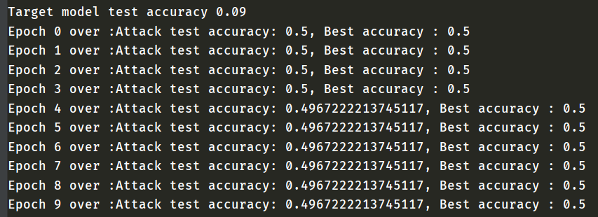

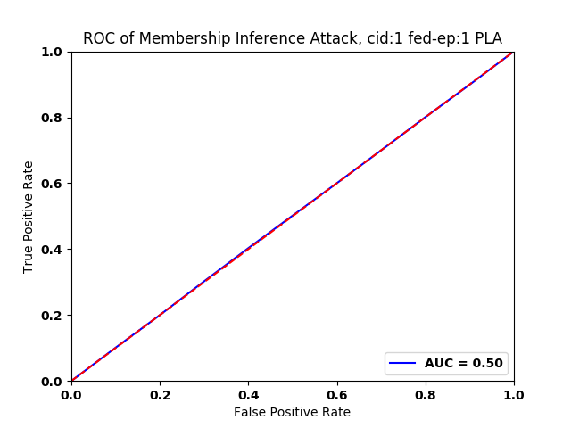

passive global attack 

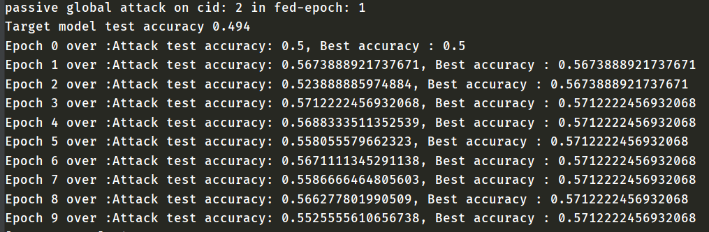

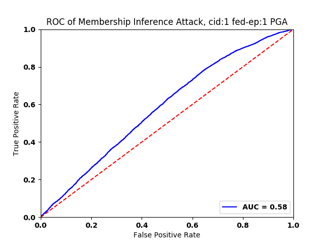

### cid: 1 in fed-epoch: 4

passive local attack

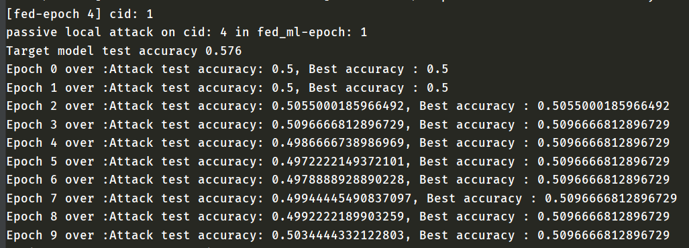

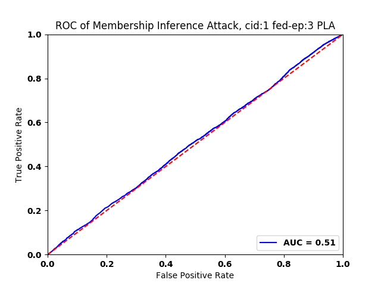

passive global attack 

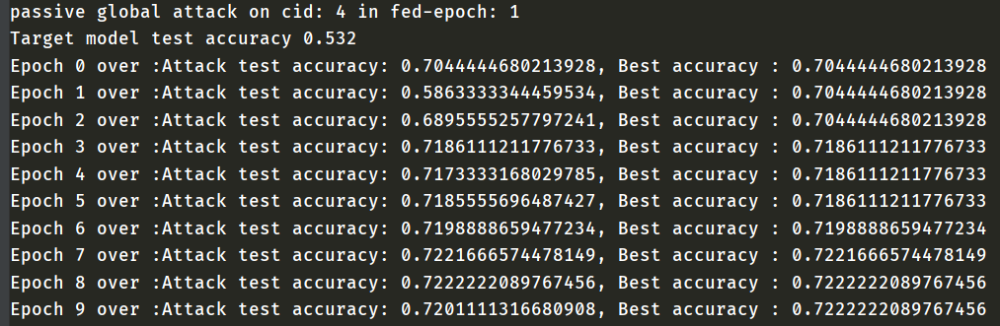

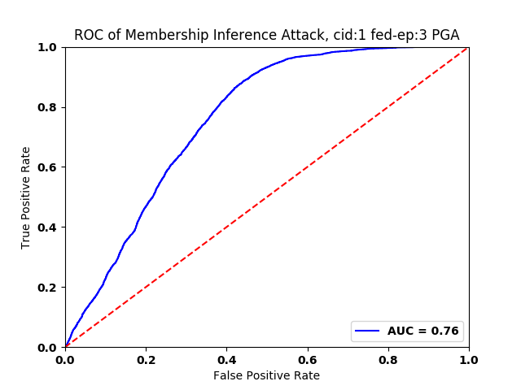

### cid: 1 in fed-epoch: 6

passive local attack

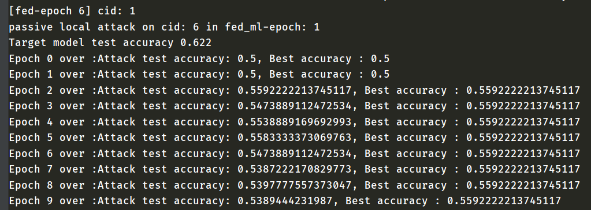

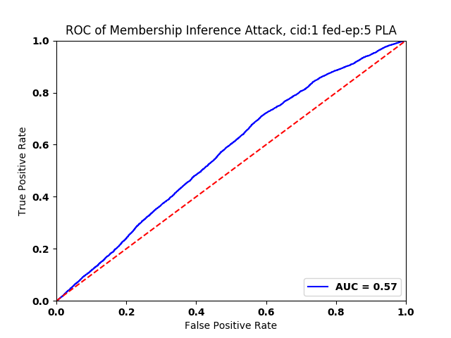

passive global attack 

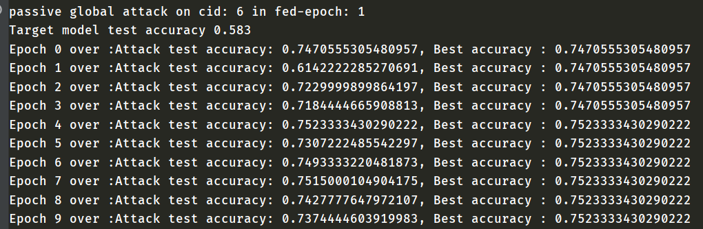

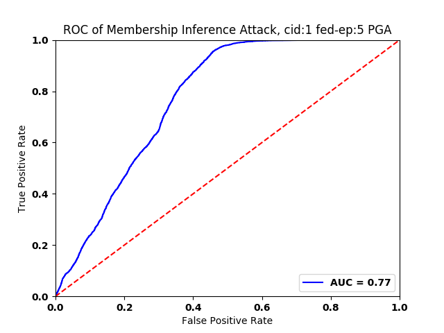

> more details  to [passive attack results](./passive_attack_results.txt)  

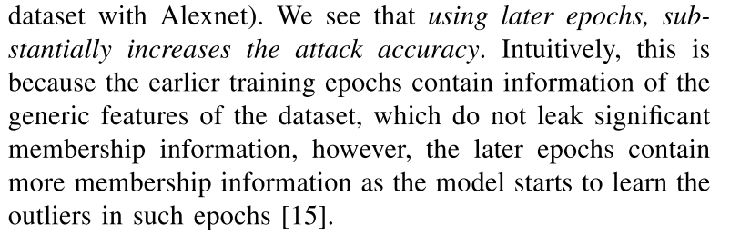

## Communications

- [Help Wanted: How To Apply This Tool?](https://github.com/privacytrustlab/ml_privacy_meter/issues/18)
- [AttributeError: 'attack_data' object has no attribute 'means'](https://github.com/privacytrustlab/ml_privacy_meter/issues/19)
- [Help Wanted: What the significance of hyperparameter `CLIENT_RATIO_PER_ROUND`](https://github.com/Zing22/tf-fed-demo/issues/1)

## Related Work

### Active Inference Attacks

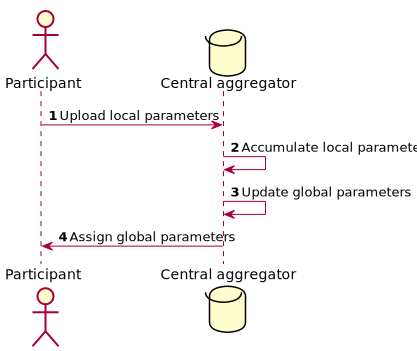

Attackers have no root to change the training process of target participant (except themselves), since altering the architecture of federated learning is not under consideration in this scenario. 

What the adversary is allowed to manipulate are model parameters, the correspondence between participants and the central aggregator.

#### The Gradient Ascend Attacker

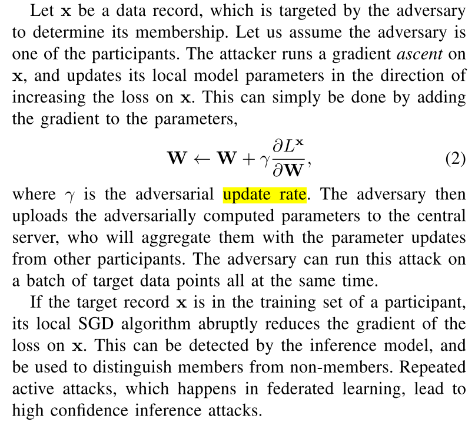

There are two vital issues that still confuse me.

- What the parameters contain, and what they mean mathematically?

- The target model consists of several layers of neurons, so which layers should be crafted as follow?
  
  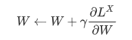

#### The Isolating Attacker


The trick in isolating attack is to leave the target participant in the state of stand-alone. Besides, only a global attacker can carry out isolating attacks in this setting.


