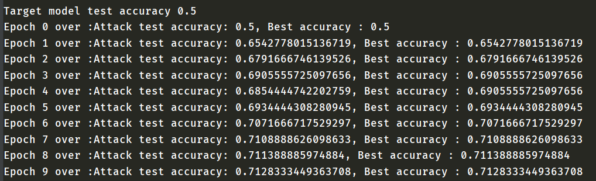
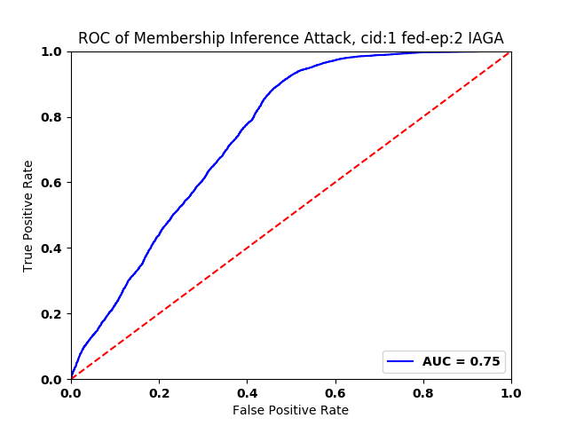
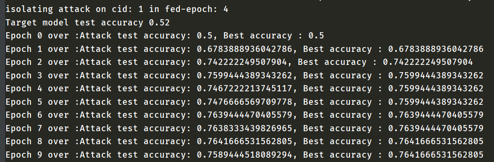
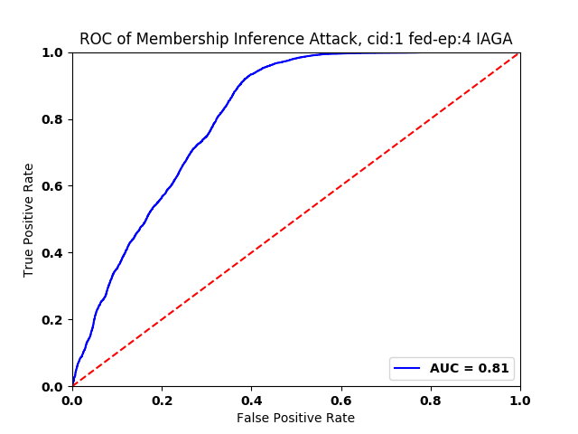
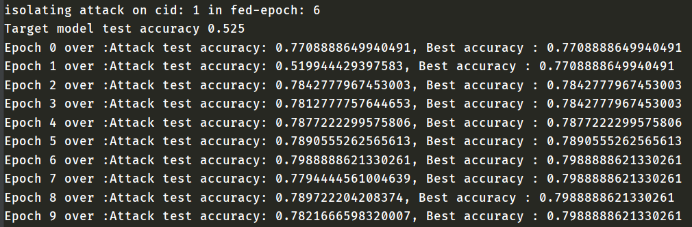
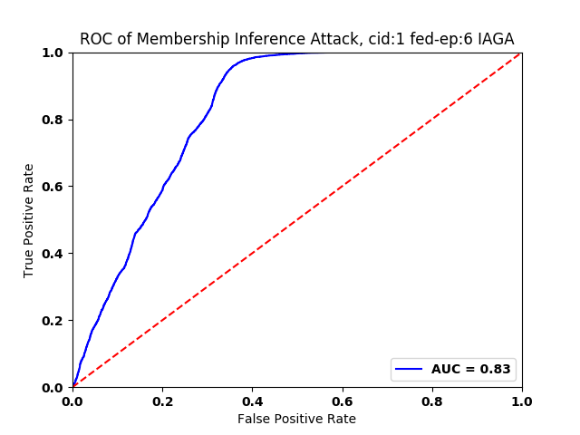

# The Report of Passive Attack


## Global Attack vs. Local Attack

To participants, there are 4 kinds of activities during federated training, three of which are in iterations.


Attack windows slide to the global attacker after uploading  participants' local parameters to the central aggregator.

> The Passive Global Attacker: In this scenario, the attacker (the parameter aggregator) has access to the target model’s parameters over multiple training epochs (see Section II-B). Thus, **he can passively collect all the parameter updates from all of the participants**, at each epoch, and can perform the membership inference attack against each of the target participants, separately.

And when global parameters are pulled down, the participant introduces a back door for local attackers as well.

> The Passive Local Attacker: A local attacker cannot observe the model updates of the participants; **he can only observe the aggregate model parameters**. We use the same attack model architecture as that of the global attack. In our experiments, there are four participants (including the local attacker). The goal of the attacker is to learn if a target input has been a member of the training data of any other participants. 

Apparently, the difference between global attackers and local attackers is **the timing of attack**. 

```python
for client_id in active_clients:
    print("[fed-epoch {}] cid: {}".format((ep + 1), client_id))
    # In each epoch, clients download parameters from the server,
    # and then train local models to adapt their parameters.
    client.download_global_parameters(server.global_parameters)
    # Perform passive local membership inference attack, since only get global parameters.
    if client_id == 1:
        print("passive local attack on cid: {} in fed_ml-epoch: {}".format((ep + 1), client_id))
        passive_attack(client, client_id)
    # Train the participant.
    client.train_epoch(cid=client_id)
    # Accumulate local parameters.
    current_local_parameters = client.upload_local_parameters()
    server.accumulate_local_parameters(current_local_parameters)
    # Perform passive global membership inference attack, since the target model's parameters are informed.
    if client_id == 1:
        print("passive global attack on cid: {} in fed-epoch: {}".format((ep + 1), client_id))
        passive_attack(client, client_id)
# Update global parameters in each epoch.
server.update_global_parameters(len(active_clients))
```

## Hypotheses

1. It is assumed that the attacker holds a subset of training set of the target participant, as well as some data from the same underlying distribution that is not contained in the training set.

2. In federated learning, the data set for each participant is the same size and has no intersection.
3. The averaging aggregation method is used for the federated scenario.
4. The size of the set of member and non-member samples  used for evaluating the attack are the same.
5. During federated training, participants will not adapt their local training processes or hyperparameters.

## Results

### Hyperparameters

|           parameter           | value   | parameter                    | value    |
| :---------------------------: | ------- | ---------------------------- | -------- |
|    number of participants     | 5       | federated training epoch     | 6        |
|         target model          | AlexNet | learning rate                | 0.0001   |
|     local training epoch      | 15      | dataset                      | cifar-10 |
| training data per participant | 10,000  | member set held by adversary | 1,000    |
|      target participant       | cid=1   | isolated participant         | cid=1    |

> Due to our limited GPU resources, no gradient was exploited in the training of attack model. 

- PGA: Passive Global Attack
- PLA: Passive Local Attack
- IAGA: Isolating Global Attack

### cid: 1 in fed-epoch: 2

passive local attack


passive global attack 


### cid: 1 in fed-epoch: 4

passive local attack


passive global attack 


### cid: 1 in fed-epoch: 6

passive local attack


passive global attack


> more details to [passive attack results](./passive-attack-results.txt)  

### Conclusions

- The latter, the more accurate the attack will be.

- Global attack is more effective than local attack.

- Overfit leaks more information of training set.

## Communications

- [Help Wanted: How To Apply This Tool?](https://github.com/privacytrustlab/ml_privacy_meter/issues/18)
- [AttributeError: 'attack_data' object has no attribute 'means'](https://github.com/privacytrustlab/ml_privacy_meter/issues/19)
- [Question: What's the relationship between 'target_train_model' and 'target_attack_model'?](https://github.com/privacytrustlab/ml_privacy_meter/issues/22)
- [Help Wanted: What the significance of hyperparameter 'CLIENT_RATIO_PER_ROUND'](https://github.com/Zing22/tf-fed-demo/issues/1)

## Related Work

### Active Inference Attacks


As parties don't trust each other in FL, local models are black-boxes for outsiders (regard the uploaded local parameters as output, while downloaded global parameters as input), and the attackers have no root to change the training process of target participant (except themselves).

What the adversary is allowed to manipulate are model parameters, the correspondence between participants and the central aggregator. More precisely, the active attacks influence the target model through the global parameters downloaded by the participants. 

#### The Gradient Ascend Attacker

> Let x be a data record, which is targeted by the adversary to determine its membership. Let us assume the adversary is one of the participants. The attacker runs a gradient ascent on x, and updates its local model parameters in the direction of increasing the loss on x. **This can simply be done by adding the gradient to the parameters**,
>
> 
>
> Where γ is the adversarial update rate. The adversary then uploads the adversarially computed parameters to the central server, who will aggregate them with the parameter updates from other participants. The adversary can run this attack on a batch of target data points all at the same time.

As known, the purpose of gradient ascend attack is to fool the target model into memorizing more information about the training set (or, record x).

#### The Isolating Attacker

> The Isolating Attacker: The parameter aggregation in the federated learning scenario negatively influences the accuracy of the membership inference attacks. An active global attacker can overcome this problem by isolating a target participant, and creating a local view of the network for it. In this scenario, the attacker does not send the aggregate parameters of all parties to the target party. Instead, the attacker isolates the target participant and segregates the target participant’s learning process.
>
> When the attacker isolates the target participant, then **the target participant’s model does not get aggregated with the parameters of other parties**. As a result, it stores more information about its training dataset in the model. Thus, simply isolating the training of a target model significantly increases the attack accuracy. 

The trick in isolating attack is to leave the target participant in the state of stand-alone: the attacker pretends local parameters (uploaded by target participant) as global parameters, and then dispatches **the fake global parameters** to target participant.

Besides, only a global attacker can carry out isolating attacks in this setting. And this strategy tends to overfit the target participant, when the amount of data available to the target participant is insufficient.

##### cid: 1 in fed-epoch: 2





##### cid: 1 in fed-epoch: 4





##### cid: 1 in fed-epoch: 6





> more details to [isolating attack results](./isolating-attack-results.txt)